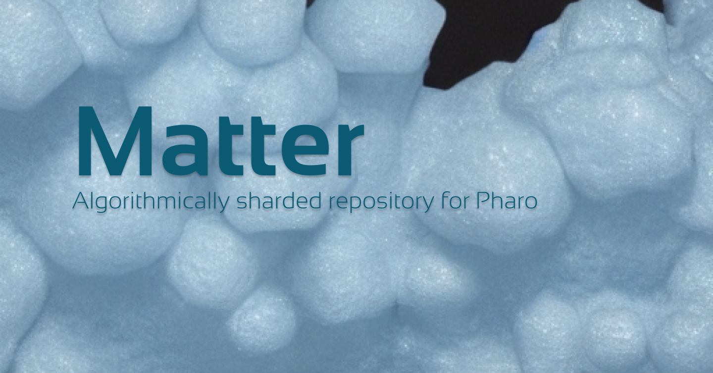

# Matter

Algorithmically sharded repository for Pharo.

[](https://github.com/sebastianconcept/matter/releases)

[](./LICENSE.txt)

---

## Features

- Basic `Dictionary` API.
- Simplicity. No transactions, no persistance, just a big cache of Pharo objects.
- Horizontably scalable by adding nodes to the shard.
- No need to create and maintain schemas.
- Homogeneously distributed data load.
- Fast as a Dictionary can be.

## Ambition

Matter gives you a performant cache of objects with a basic Dictionary API and scalable by the number of Pharo images configured in the clients. 

## Examples

```Smalltalk
"Start 3 servers (in the same image just for testing)"
server1 := MTServer startOn: 1901.
server2 := MTServer startOn: 1902.
server3 := MTServer startOn: 1903.

"Stop them later"
server1 stop.
server2 stop.
server3 stop.
```

```Smalltalk
"Create the client of the shard."
	urls := { 
		'ws://localhost:1901'.
		'ws://localhost:1902'.
		'ws://localhost:1903'.
	 }.
	client := Matter fromUrls: urls.
```

```Smalltalk
"Add objects to the shard"
client at: #store40 put: 40.
client at: #store41 put: 41.
client at: #store42 put: 42.
```

```Smalltalk
"Query objects from the shard."
found := client at: #store42.
found == 42.
```

```Smalltalk
"Checking server storage's size"
(client nodes at: 'ws://localhost:1901') size == 2.
(client nodes at: 'ws://localhost:1902') size == 0.
(client nodes at: 'ws://localhost:1903') size == 1.
client size == 3.
```

## Installation

Open a Pharo workspace and evaluate:

```smalltalk
Metacello new
  baseline: 'Matter';
  repository: 'github://sebastianconcept/matter/src';
  load
```

## Include as dependency

In BaselineOf or ConfigurationOf it can be added in this way:

```smalltalk
spec
  baseline: 'Matter'
    with: [ spec
    repository: 'github://sebastianconcept/matter/src';
    loads: #('Core' 'Core-Tests' 'Client' 'Server' 'Client-Tests' 'Server-Tests') ]
```

## Benchmarks
Here are some benchmarks to quantify its optimization potential using the production data that ispired this work:

```smalltalk
ABBench bench: [ 
    ABBench 
          a: [ bench queryMongoTimes: 10000 ] 
          b: [ bench queryMatterTimes: 10000 ].
    ].
"B is 317.29% FASTER than A"
```

```smalltalk
ABBench bench: [ 
    ABBench 
    	a: [ bench queryRedisTimes: 1000 ] 
	b: [ bench queryMatterTimes: 1000 ].
    ].

"B is 191.47% FASTER than A" 
```

## Docker
### Image build

```bash
docker build -t matter . 
```
### Container run

```bash
docker run --rm -e MATTER_PORT=1901 -p 1901:1901 matter
```

### Cluster with docker-compose

This will start/stop a Matter cluster of 5 MTServer nodes. Starting in port 1901 and ending in 1905.

```bash
docker-compose up -d
```
